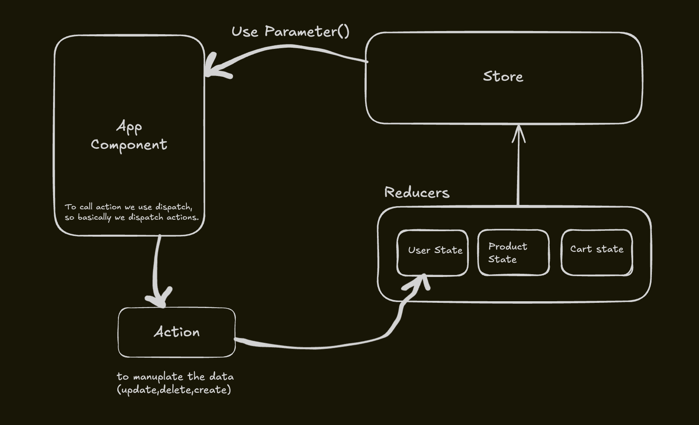

# Frontend Setup with React, Vite, Tailwind & React Router

## 🚀 Initial Setup
1. **Installed React using Vite**
   ```sh
   npm create vite@latest my-project --template react
   cd my-project
   npm install
   ```
2. **Installed Tailwind CSS**
   ```sh
   npm install -D tailwindcss postcss autoprefixer
   npx tailwindcss init -p
   ```
3. **Installed Daisy UI for React Components**
   ```sh
   npm install daisyui
   ```

## 🎨 Tailwind Configuration
- Modified `tailwind.config.js` according to the documentation:
   ```js
   module.exports = {
     content: ["./index.html", "./src/**/*.{js,ts,jsx,tsx}"],
     theme: {
       extend: {},
     },
     plugins: [require("daisyui")],
   };
   ```

## 🏗️ Routes Setup
### Implemented inside `App.jsx`:
```jsx
import { BrowserRouter, Routes, Route } from "react-router-dom";
import Body from "./components/Body";
import Login from "./components/Login";
import Signup from "./components/Signup";

function App() {
  return (
    <BrowserRouter basename="/">
      <Routes>
        <Route path="/" element={<Body />}>
          <Route path="login" element={<Login />} />
          <Route path="signup" element={<Signup />} />
        </Route>
      </Routes>
    </BrowserRouter>
  );
}

export default App;
```

## 🏗️ Body Component Structure (`Body.jsx`)
```jsx
import { Outlet } from "react-router-dom";
import Navbar from "./Navbar";
import Footer from "./Footer";

function Body() {
  return (
    <div>
      <Navbar />  {/* Renders on all pages */}
      <Outlet />  {/* Handles child routes */}
      <Footer />  {/* Renders on all pages */}
    </div>
  );
}

export default Body;
```

## ✅ Summary
- Installed **React** with **Vite** for a fast setup.
- Integrated **Tailwind CSS** for styling and **DaisyUI** for pre-designed components.
- Configured **React Router** for navigation.
- Defined a structured **component-based architecture** with `Body.jsx` managing layout.

This setup ensures **scalability, performance, and modularity** for our frontend application! 🚀

</br>
</br>
# MERN Stack Application Notes

## Handling CORS in a MERN Stack Application

### What is CORS?
CORS (**Cross-Origin Resource Sharing**) is a security feature implemented by browsers that restricts web applications from making requests to a different domain or port than the one that served the web page. This is to prevent unauthorized access and potential security risks.

By default, browsers block frontend applications from accessing APIs hosted on different origins (e.g., different domains or ports). Even if the frontend and backend are running on the same server but on different ports (e.g., frontend on `http://localhost:3000` and backend on `http://localhost:5000`), the browser enforces CORS restrictions.

### Solving CORS Issues in Backend
To allow the frontend to communicate with the backend, we need to configure CORS properly in our Node.js server.

#### Installing CORS Middleware
Use the following command to install the CORS middleware in your backend project:
```sh
npm install cors
```

#### Setting Up CORS in Express (Backend)
In the backend, we configure the middleware to allow requests from the frontend URL:

```javascript
const express = require("express");
const cors = require("cors");
const app = express();

app.use(cors({
  origin: "http://localhost:3000", // Replace with the frontend server URL
  credentials: true // Allows cookies and authentication headers to be shared
}));
```

This setup ensures that the frontend (React) can access the backend API (Express) without CORS errors.

### Handling CORS on the Frontend
When making API requests using **Axios** from the frontend, we need to explicitly enable credentials (cookies, authorization headers, etc.). Without this setting, cookies won't be stored in the browser.

#### Making API Calls with Axios
```javascript
import axios from "axios";

axios.get("http://localhost:5000/api/data", {
  withCredentials: true // Ensures cookies and credentials are included
})
.then(response => console.log(response.data))
.catch(error => console.error("Error fetching data:", error));
```

### Summary
1. **CORS prevents frontend-backend communication across different origins** for security reasons.
2. **To enable cross-origin requests**, we use the `cors` middleware in our backend (`app.use(cors({ origin: "frontend_URL", credentials: true }))`).
3. **On the frontend**, we set `{ withCredentials: true }` when making requests using Axios to ensure that cookies and authentication data are included.

This setup ensures smooth communication between the frontend and backend in a MERN stack application. 🚀

</br>



</br>
# Redux Toolkit Notes

## Setting Up Redux Toolkit

1. **Created a separate folder for store:**
   - Organized the Redux store inside a dedicated `store` folder for better maintainability.

2. **Configured a Redux store:**
   - The store contains reducers that handle different slices of state.
   - Example setup:
   
   ```javascript
   import { configureStore } from "@reduxjs/toolkit";
   import userReducer from "../slices/userSlice";
   
   const store = configureStore({
       reducer: {
           user: userReducer,
       },
   });
   
   export default store;
   ```

3. **Created slices:**
   - Used `createSlice` to manage state.
   - Each slice contains an initial state, reducers (functions to modify the state), and actions.
   
   ```javascript
   import { createSlice } from "@reduxjs/toolkit";
   
   const userSlice = createSlice({
       name: "user",
       initialState: { name: "", profileImg: "" },
       reducers: {
           setUser: (state, action) => {
               state.name = action.payload.name;
               state.profileImg = action.payload.profileImg;
           },
           logoutUser: (state) => {
               state.name = "";
               state.profileImg = "";
           },
       },
   });
   
   export const { setUser, logoutUser } = userSlice.actions;
   export default userSlice.reducer;
   ```

## Adding Data to Redux Store

- **Using `useDispatch()`:**
  - `useDispatch` is a React-Redux hook used to update the Redux store.
  - Example:
    
    ```javascript
    import { useDispatch } from "react-redux";
    import { setUser } from "../slices/userSlice";
    
    const dispatch = useDispatch();
    dispatch(setUser({ name: "John Doe", profileImg: "profile.jpg" }));
    ```

## Accessing Data from Redux Store

- **Using `useSelector()`:**
  - `useSelector` allows us to access the Redux store data.
  - Example:
    
    ```javascript
    import { useSelector } from "react-redux";
    
    const user = useSelector((store) => store.user);
    console.log(user.name, user.profileImg);
    ```

## Making the Navbar Dynamic

- Used `useSelector` to dynamically update the navbar based on the logged-in user.
  
  ```javascript
  const user = useSelector((store) => store.user);
  
  return (
      <nav>
          
          <span>{user.name}</span>
      </nav>
  );
  ```

## Organizing Utility Functions

- **Created a `utils` folder:**
  - Inside `utils`, we stored constants like the base URL.
  
  ```javascript
  export const BASE_URL = "https://api.example.com";
  ```
  - Imported it wherever needed:
  
  ```javascript
  import { BASE_URL } from "../utils/constants";
  ```

</br>
</br>
<!-- Notes
  

const requestSlice = createSlice({
    name:"request",
    initialState: null,
    reducers:{
        addRequest: (state,action)=> action.payload,
        removeRequest: (state, action) => {
            const newArray = state.receivedRequests.filter((r)=>r._id !== action.payload);
            return newArray;
        }
    }
})

  This is reducer we have created for adding data which is comming from request API into redux store. So in the removeRequest we are removing particular id which is either accepeted or ignored by user. 

  In this entire process what's happening is -> At our backend we have created a API which is finding connection request id from database which user has been sent by connection request to logged in user.

  toUserId: loggedInuser._id -> this is how we are finding request ID's

  now in the redux store we have added this data which mongodb has found. From backend we are sending data in json format which has a key named receivedRequests. 

  In this key there is data and when the user accepts the request this id which was found by mongoose will be removed because its status is been updated to accepted.

  so once this request is accpeted and id has changed it's status not it's time to remove it from our redux store.

  Before removing there is one important thing to notice which is when this id is had changed it's status and moongoose finds id on the basic of status and toUserId not it won't find this id which has been updated. So when we refresh webpage and again this api called will happen and again data will be filled into redux store now it won't contain this userId which we have accepted...it will be removed from requests component.

  But this is where the problem is user has to refresh the page to see the change therefore we have created removeUser action into reduceres.

  which takes id i.e. the document id which is has all this data as parament and now we apply filter on  const newArray = state.receivedRequests.filter((r)=> r._id !== action.payload)
  return newArray

 -->


## Redux Slice for Request Handling

We created a **Redux Slice** to manage connection requests in our application. The `requestSlice` stores requests received by the logged-in user and provides actions to update the store when requests are accepted or ignored.

### **Request Slice Implementation**

```javascript
const requestSlice = createSlice({
    name: "request",
    initialState: null,
    reducers: {
        addRequest: (state, action) => action.payload,
        removeRequest: (state, action) => {
            const newArray = state.receivedRequests.filter((r) => r._id !== action.payload);
            return newArray;
        }
    }
});
```

### **Explanation of Reducer Actions**

- **`addRequest`**:  
  - Stores the request data received from the backend API into Redux.
  - The payload is the data fetched from MongoDB, containing connection requests for the logged-in user.

- **`removeRequest`**:  
  - When a user **accepts** or **ignores** a request, we remove it from the Redux store.
  - This is done by filtering out the request with the specified `_id` from `receivedRequests`.

---

## **How the Process Works**

### 1️⃣ **Fetching Connection Requests from Backend**

- The backend API finds **connection requests** received by the logged-in user.
- It queries MongoDB using:  
  
  ```javascript
  toUserId: loggedInUser._id
  ```

- This fetches all requests where `toUserId` matches the logged-in user's `_id`.
- The backend sends the fetched data in JSON format, structured like this:

  ```json
  {
    "receivedRequests": [
      {
        "_id": "request1",
        "fromUserId": "user123",
        "status": "pending"
      },
      {
        "_id": "request2",
        "fromUserId": "user456",
        "status": "pending"
      }
    ]
  }
  ```

### 2️⃣ **Storing Data in Redux**

- The frontend stores the `receivedRequests` data in Redux using the `addRequest` action.

### 3️⃣ **Handling Request Acceptance or Ignoring**

- When a user **accepts** or **ignores** a request, the request’s `status` is updated in the database.
- Once the status changes, **MongoDB will no longer return this request** when we fetch connection requests.
- However, since Redux still holds this outdated data, the request remains visible **until the user refreshes the page**.

### 4️⃣ **Removing Request from Redux Store**

- To provide a seamless user experience **without requiring a page refresh**, we use the `removeRequest` action.
- This action removes the request **immediately from the Redux store** once the user accepts or ignores it.

  ```javascript
  const newArray = state.receivedRequests.filter((r) => r._id !== action.payload);
  return newArray;
  ```

- This ensures that the UI updates instantly, improving user experience.

---

## **Final Thoughts**

- By leveraging **Redux**, we efficiently manage state changes without requiring a page reload.
- The **removeRequest** action helps provide real-time UI updates when connection requests are processed.
- Using **MongoDB queries** combined with Redux ensures **better performance and optimized state management**.

